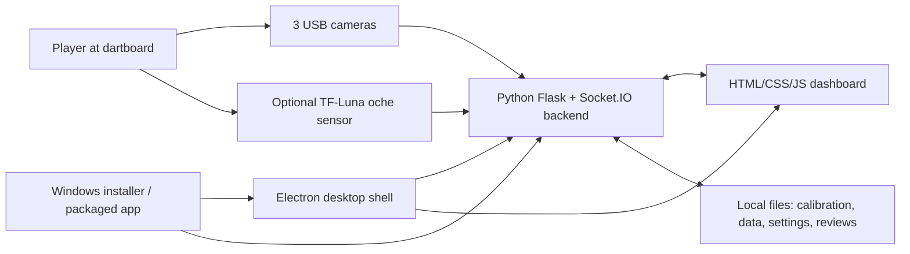
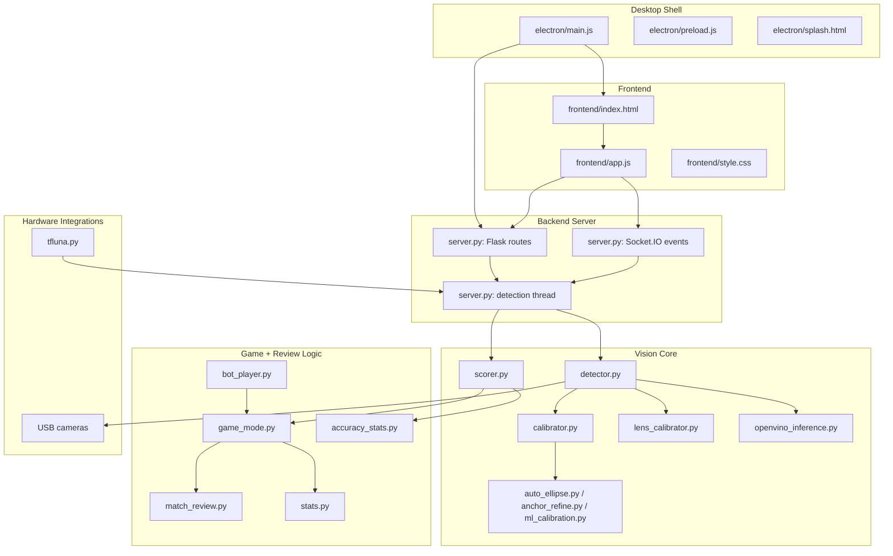
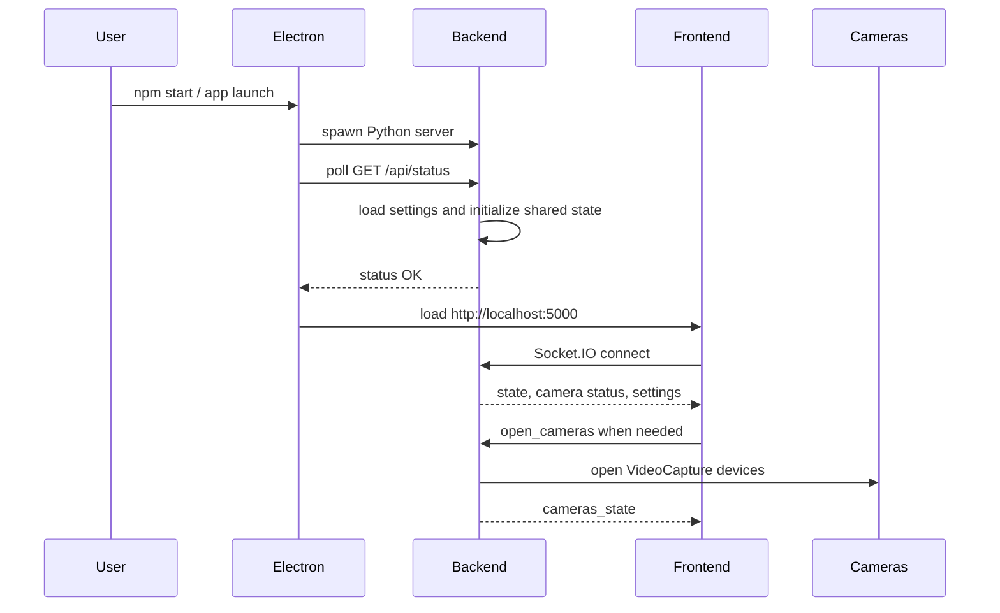
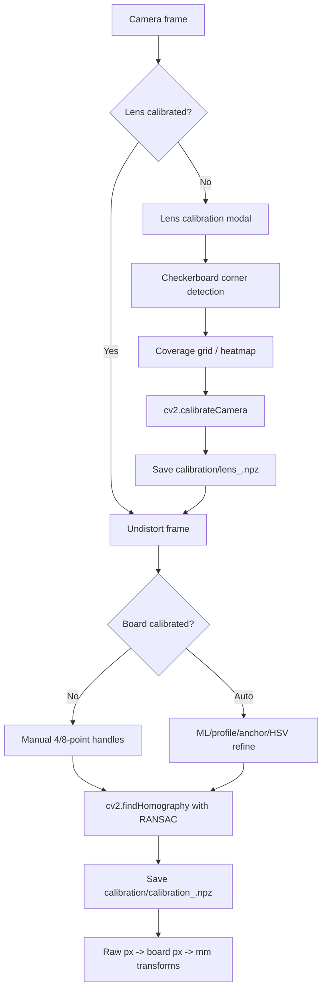
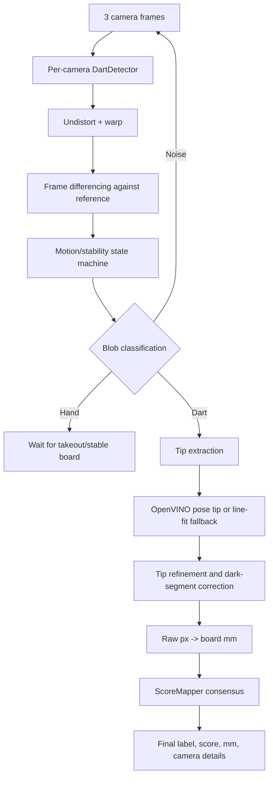
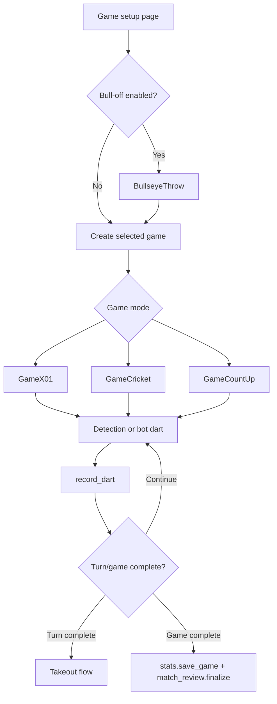
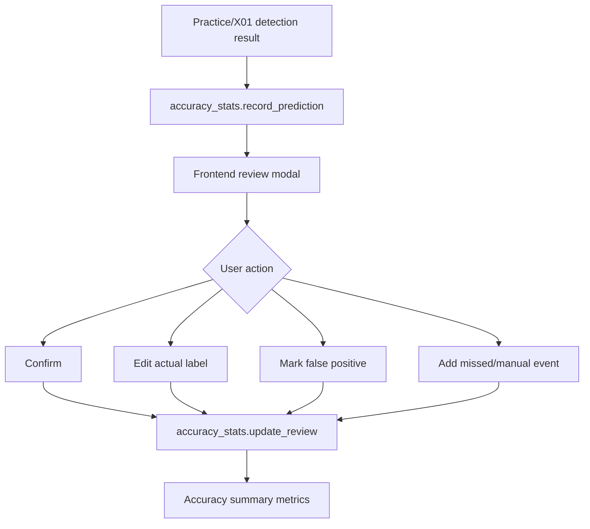
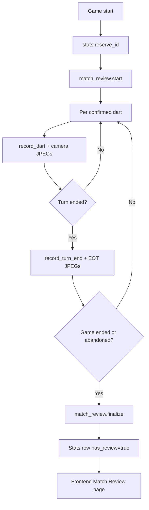
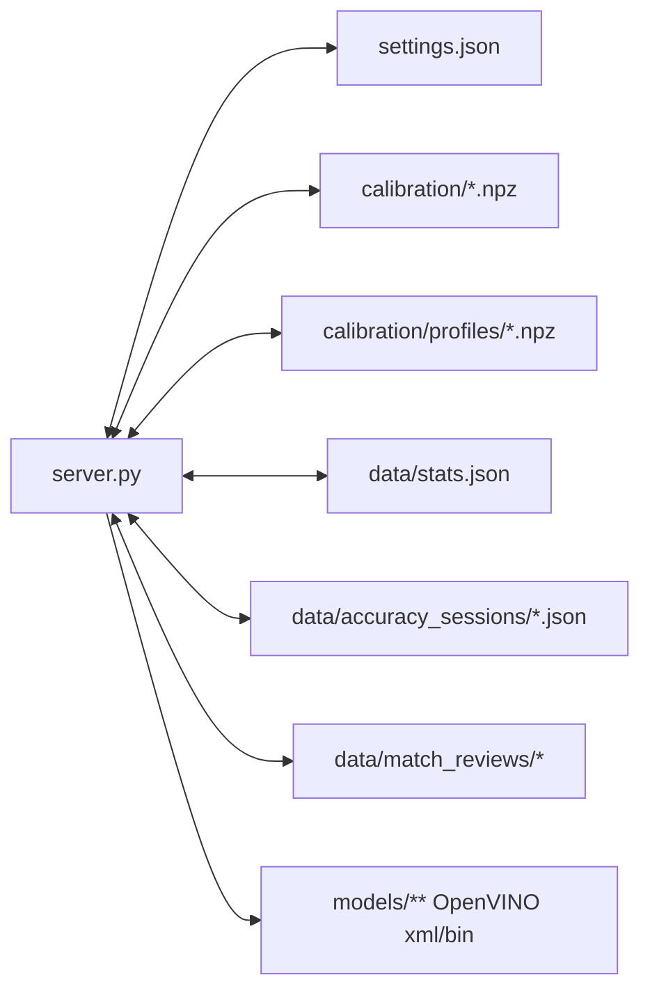
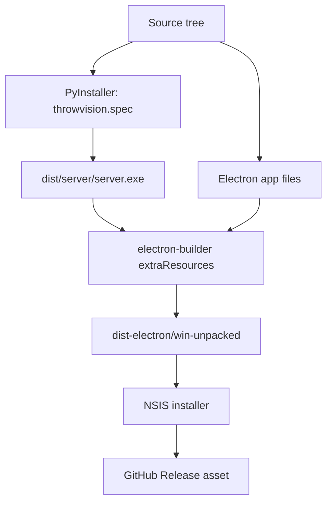

# ThrowVision System Architecture

This document describes the full ThrowVision architecture: desktop shell, Flask/Socket.IO backend, computer-vision pipeline, game engines, review systems, persistence, and release packaging.

ThrowVision is built around one core loop:

```text
calibrate cameras -> detect dart tips -> fuse camera results -> apply game rules -> persist stats/reviews -> update UI
```

## 1. System Context



ThrowVision can run in two modes:

| Mode | Entry point | Backend | UI |
|---|---|---|---|
| Desktop app | `npm start` or packaged installer | Electron starts Python server | Electron loads `http://localhost:5000` |
| Browser only | `python server.py` | User starts Flask directly | Browser opens `http://localhost:5000` |

## 2. Runtime Layers



## 3. Main Components

| Area | File(s) | Responsibility |
|---|---|---|
| Desktop shell | `electron/main.js` | Starts/stops backend, waits for `/api/status`, opens the Electron window, bundles `dist/server` in packaged mode. |
| Frontend shell | `frontend/index.html`, `frontend/style.css` | Defines pages, modals, game views, calibration UI, stats UI, match review UI, and responsive layout. |
| Frontend logic | `frontend/app.js` | Page navigation, Socket.IO event handling, API calls, game setup, practice review, match review, stats rendering. |
| Server orchestration | `server.py` | Flask routes, Socket.IO handlers, camera lifecycle, detection loop, game lifecycle, review lifecycle, settings, build-time static serving. |
| Configuration | `config.py`, `settings.json` | Runtime capture, detection, OpenVINO, calibration, latency, TF-Luna, and UI settings. |
| Camera detection | `detector.py` | Per-camera frame capture, motion state machine, contour detection, pose/line-fit tip extraction, takeout handling. |
| Board calibration | `calibrator.py` | 4/8-point homography, camera-to-board transforms, masks, wireframe rendering, calibration cache. |
| Lens calibration | `lens_calibrator.py` | Checkerboard capture, coverage tracking, distortion solve, undistortion cache. |
| Auto calibration | `auto_ellipse.py`, `anchor_refine.py`, `ml_calibration.py`, `board_profile.py` | HSV ring refinement, anchor refinement, OpenVINO-assisted calibration, saved board profile matching. |
| Inference runtime | `openvino_inference.py`, `yolo_verifier.py` | OpenVINO detection/pose wrappers and optional legacy YOLO validation. |
| Scoring | `scorer.py` | Converts mm coordinates to dart labels/scores and fuses camera results by consensus. |
| Game engines | `game_mode.py` | Bullseye throw-off, X01, Cricket, Count Up rules and state. |
| Bot opponent | `bot_player.py` | Simulated and auto-advance bot darts for game-flow testing. |
| Game stats | `stats.py` | Saves match summaries and aggregates game statistics. |
| Accuracy stats | `accuracy_stats.py` | Stores Practice/X01 review sessions and computes accuracy metrics. |
| Match review | `match_review.py` | Stores per-match review JSON and camera frames; renders annotated review images. |
| Oche sensor | `tfluna.py` | Optional TF-Luna serial reader and distance/foul-line telemetry. |

## 4. Startup Flow



In packaged mode, Electron starts the PyInstaller-built server from:

```text
process.resourcesPath/server/server.exe
```

and uses Electron's user-data directory for writable runtime data such as calibration, profiles, and stats.

## 5. Calibration Architecture

Calibration creates the geometry used by every score.



### Lens Calibration

`lens_calibrator.py` uses a checkerboard workflow:

1. Detect checkerboard corners in live frames.
2. Track coverage across the camera image.
3. Solve camera matrix `K` and distortion coefficients.
4. Save per-camera lens calibration files.
5. Apply `cv2.undistort()` before board detection/scoring.

### Board Calibration

`calibrator.py` supports manual and assisted calibration:

1. User places 4 or 8 board anchors.
2. The system maps source camera pixels to canonical dartboard coordinates.
3. RANSAC homography solves perspective warp.
4. Calibration quality and masks are computed.
5. The mm homography is cached for scoring reloads.

### Auto Calibration Sources

| Source | Role |
|---|---|
| `ml_calibration.py` | Uses OpenVINO calibration model detections to infer board correspondences. |
| `board_profile.py` | Reuses saved board profiles for known physical setups. |
| `anchor_refine.py` | Searches for local wire/ring anchors near expected positions. |
| `auto_ellipse.py` | Uses color/ellipse/ring evidence to refine rough handles. |

## 6. Detection and Scoring Architecture



Each camera runs independently and reports a candidate tip. `ScoreMapper` fuses candidates into one result.

### Detector State Machine

| State | Meaning |
|---|---|
| `WAIT` | Board reference is stable; detector waits for motion. |
| `MOTION` | Motion is present; detector waits for it to settle. |
| `STABLE` | New object is stable enough to classify. |
| `DART` | Dart candidate is extracted and transformed. |
| `TAKEOUT` | System waits for hand/takeout after turn completion. |

### Consensus Priority

`scorer.py` resolves camera disagreement with this priority:

1. Cross-camera mask intersection.
2. Majority agreement.
3. Outlier rejection.
4. Quality-weighted average.
5. Near-boundary best-camera fallback.
6. Single-camera fallback.

The final score object includes:

```text
label, score, x_mm, y_mm, agreement_bucket, cam_details, timing
```

That object becomes the shared input for Practice review, game engines, match review, and stats.

## 7. Game Flow Architecture



### Game Engines

| Engine | Rules |
|---|---|
| `BullseyeThrow` | Determines first player by closest-to-bull throw. |
| `GameX01` | 301/501/701/901 countdown, bust handling, optional double-out. |
| `GameCricket` | Marks 15-20 and bull; scoring only against open targets. |
| `GameCountUp` | Fixed-round high-score mode with optional variants. |

### Bot Darts

`bot_player.py` can generate:

| Mode | Behavior |
|---|---|
| `simulated` | Generates realistic mm coordinates around a target based on skill. |
| `auto_advance` | Emits guaranteed misses to exercise game-flow automation. |

Bot turns temporarily pause camera scoring so generated darts cannot collide with real detection events.

## 8. Review and Stats Architecture

ThrowVision has two review systems:

| System | Scope | Purpose |
|---|---|---|
| Accuracy Review | Practice and X01 turns | Measures detector correctness with manual correction. |
| Match Review | Full games | Lets users inspect per-dart and end-of-turn camera captures after matches. |

### Accuracy Review Flow



Metrics include precision, recall, false positives, missed darts, corrections, camera agreement, and latency.

### Match Review Flow



Match review data is intentionally split:

```text
data/match_reviews/
  match_<id>.json
  match_<id>/
    frames/
      p1_r1_d0_cam0.jpg
      p1_r1_d0_cam1.jpg
      p1_r1_d0_cam2.jpg
      p1_r1_eot_cam0.jpg
```

The JSON stores match metadata, players, turns, dart predictions, camera details, frame flags, and status. Raw frames are served directly; annotated frames are rendered on demand.

## 9. API and Socket Architecture

### HTTP API Groups

| Group | Examples | Purpose |
|---|---|---|
| Status/settings | `/api/status`, `/api/settings` | Health, config, detection profile, OpenVINO, TF-Luna. |
| Camera checks | `/api/cameras/probe`, `/api/cameras/resolutions` | Physical camera validation and supported resolution discovery. |
| Streams | `/api/stream/raw/<cam>`, `/api/stream/warped/<cam>` | MJPEG camera preview feeds. |
| Board calibration | `/api/cal/frame`, `/api/cal/accept`, `/api/cal/refine`, `/api/cal/auto` | Manual and assisted board calibration. |
| Lens calibration | `/api/lens/status`, `/api/lens/autoframe`, `/api/lens/capture`, `/api/lens/compute` | Checkerboard lens calibration workflow. |
| Board profile | `/api/board/register`, `/api/board/list`, `/api/board/select` | Save/load/delete physical board profiles. |
| Stats | `/api/stats`, `/api/stats/recent`, `/api/stats/game/<id>` | Game stats and match history. |
| Accuracy | `/api/accuracy/summary`, `/api/accuracy/sessions`, `/api/accuracy/review` | Accuracy review persistence and aggregation. |
| Match review | `/api/matches/<id>/review`, `/api/matches/<id>/frame/...` | Post-game review data and images. |
| TF-Luna | `/api/tfluna/scan`, `/api/tfluna/probe`, `/api/distance` | Oche sensor discovery and telemetry. |

### Socket.IO Events

| Direction | Events | Purpose |
|---|---|---|
| Frontend -> backend | `open_cameras`, `close_cameras`, `start_detection`, `stop_detection` | Camera and detection lifecycle. |
| Frontend -> backend | `start_bullseye`, `start_game`, `undo_dart`, `end_game`, `skip_takeout` | Game lifecycle controls. |
| Frontend -> backend | `practice_reset_turn`, `clear_tips`, `update_settings` | Practice and runtime controls. |
| Backend -> frontend | `dart_scored`, `state`, `game_state`, `game_over` | Live scoring and game state. |
| Backend -> frontend | `cam_status`, `cameras_state`, `detection_state`, `server_log` | Runtime status and diagnostics. |
| Backend -> frontend | `accuracy_session`, `practice_reset`, `practice_awaiting_takeout` | Accuracy review and Practice mode state. |
| Backend -> frontend | `distance_update`, `foul_warning`, `tfluna_status` | Oche sensor telemetry and foul warnings. |

## 10. Persistence Architecture



| Path | Tracked? | Contents |
|---|---|---|
| `settings.json` | No | Local runtime settings. |
| `calibration/*.npz` | No | Per-camera board/lens calibration. |
| `calibration/profiles/*.npz` | No | Saved board profiles. |
| `data/stats.json` | No | Game history and aggregate source records. |
| `data/accuracy_sessions/` | No | Accuracy review session JSON. |
| `data/match_reviews/` | No | Match review JSON and JPEG frame bundles. |
| `models/` | Yes | OpenVINO model files used by calibration/detection. |

Runtime data is ignored because it is machine-specific and can contain large local captures.

## 11. Build and Release Architecture



### Build Steps

```bash
npm run pyinstaller
npm run build:win
```

### Packaged App Layout

In the packaged Windows app:

```text
ThrowVision.exe
resources/
  app.asar
  server/
    server.exe
    _internal/
```

Electron starts `resources/server/server.exe`, then loads the Flask frontend from localhost.

## 12. Failure Handling and Recovery

| Failure | Handling |
|---|---|
| Backend does not start | Electron splash times out and shows startup error. |
| Camera missing | Camera probe and pre-flight checks block Practice/Game launch. |
| Calibration missing | Calibration status fails pre-flight; UI prompts calibration. |
| Camera drops mid-match | Camera status updates; capture/review can skip missing cams. |
| User quits mid-match | Match is saved as abandoned when possible. |
| Server exits mid-match | Shutdown handler attempts abandoned match finalization. |
| Review folder without JSON | `match_review.scan_orphans()` renames orphan folders instead of deleting. |
| TF-Luna absent | Sensor remains disabled or disconnected; scoring still works. |

## 13. Extension Points

| Area | Extension idea | Likely files |
|---|---|---|
| New game mode | Add engine + frontend renderer + start options | `game_mode.py`, `server.py`, `frontend/app.js`, `frontend/index.html` |
| New calibration method | Add source of board correspondences | `server.py`, `calibrator.py`, new helper module |
| New detector model | Add OpenVINO model directory and post-processing | `openvino_inference.py`, `detector.py`, `models/` |
| Match review editing | Apply corrected darts back into match stats | `match_review.py`, `stats.py`, `frontend/app.js` |
| Cloud/export | Serialize stats/reviews to zip/PDF/API | `match_review.py`, `stats.py`, new export module |
| Storage cleanup | Add retention policy and UI controls | `match_review.py`, `accuracy_stats.py`, `frontend/app.js` |

## 14. Architectural Boundaries

ThrowVision keeps these boundaries intentionally clear:

1. `detector.py` finds per-camera tip candidates but does not decide game rules.
2. `scorer.py` decides board label/score consensus but does not mutate game state.
3. `game_mode.py` owns game rules but does not know about cameras.
4. `stats.py`, `accuracy_stats.py`, and `match_review.py` persist different concerns.
5. `server.py` is the orchestration layer that wires hardware, scoring, games, review, and UI events together.
6. `frontend/app.js` renders state and sends commands; backend remains the source of truth for scoring and games.

This separation keeps calibration/detection improvements from leaking into game rules, and keeps UI changes from changing scoring behavior.
