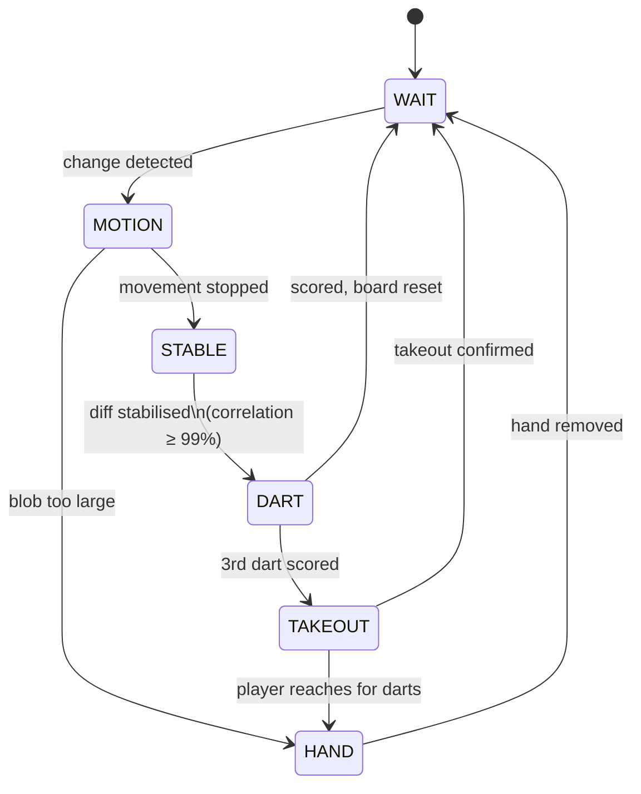
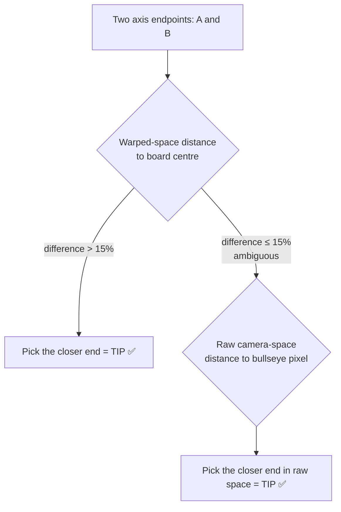
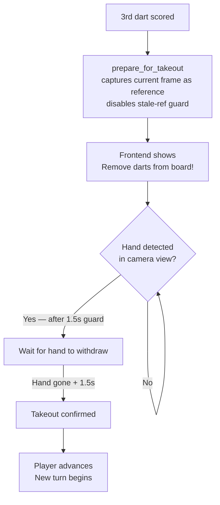
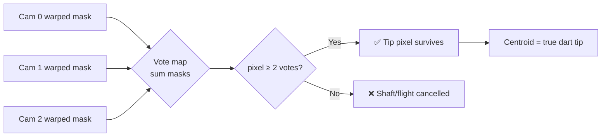
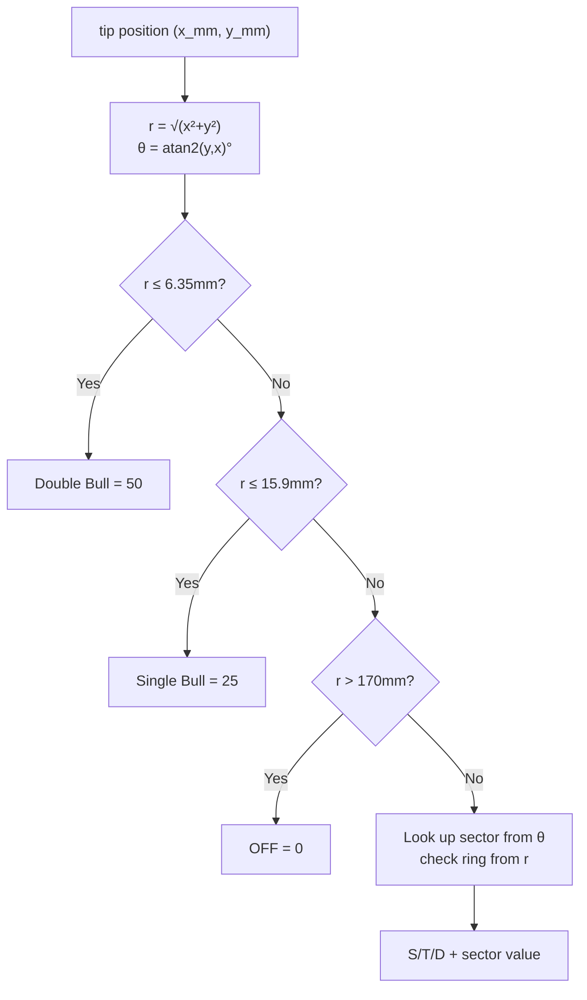
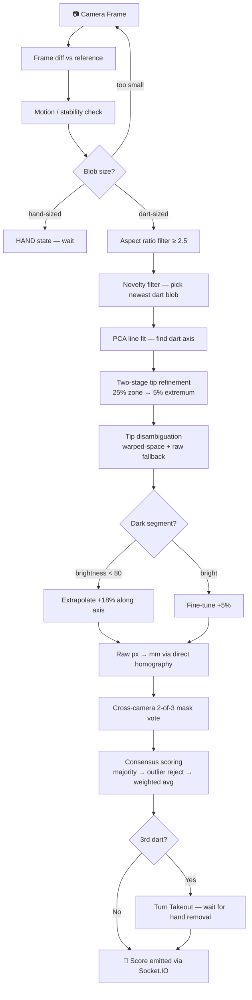

# ThrowVision 🎯


**ThrowVision** is an open-source, camera-based automatic dart scoring system. It uses three USB webcams arranged at 120° intervals around the dartboard to detect dart tips with millimetre accuracy using frame differencing, perspective homography, and multi-camera consensus fusion.

---

## Features

- 🎯 **3-camera automatic scoring** — triangulates the dart tip from three viewing angles, eliminating shaft/barrel parallax
- 🔀 **Cross-camera mask intersection** — only the dart tip (on the board surface) survives the 2-of-3 vote; flights and shaft cancel out
- 🧮 **Multi-camera consensus** — majority vote, outlier rejection, quality-weighted averaging, near-boundary tiebreaking
- 🎮 **Game modes** — X01 (301/501/701/901), Cricket, Count Up, Bullseye throw-off
- 🌐 **Live web dashboard** — real-time scoring at `http://localhost:5000`
- 📐 **4-point perspective calibration** — saved per-camera, auto-rescaled on resolution change
- 🤖 **Opportunistic scan** — cameras that miss the initial detection window run a one-shot frame-diff scan to contribute to multi-camera consensus
- ✋ **Turn takeout system** — after 3 darts the board blocks new dart detection, waits for physical dart removal via hand detection, then advances the player turn
- 🔄 **System checker** — "Preparing Practice / Game" startup screen checks server, cameras, calibration, board profile, and detection engine before launching
- 📡 **Offline guard** — all pages (Practice, Game, Stats) show a "System Offline" modal if the server is not connected; disconnect redirects gracefully to home

---

## Hardware Requirements

| Item | Spec |
|---|---|
| Cameras | 3× USB webcams, 1080p recommended |
| USB | USB 2.0 — each camera on its own USB controller |
| OS | Windows (tested) / Linux |
| CPU | Any modern x86-64 multi-core |
| GPU | Not required — detection is pure CPU-based OpenCV |

### Camera Mounting

Mount 3 cameras at **equal 120° intervals** around the board. The even spacing is critical — it ensures the cross-camera parallax cancellation works correctly from all three directions.

| View | Diagram |
|:---:|:---:|
| **Top-down** — 120° spacing | **Side view** — ~45° angle, 35–45 cm above board |
|  |  |

**Checklist before you start:**
- ✅ All 3 cameras are at the same height (board centre level or slightly above)
- ✅ Each camera is angled ~45° downward toward the board centre
- ✅ The full board is visible in each camera's frame
- ✅ Each USB camera is on its own USB controller (avoids bandwidth conflicts)
- ✅ Cameras are **rigidly mounted** — any wobble after calibration breaks accuracy

---

## Installation

```bash
git clone https://github.com/kashiwagiren/ThrowVision.git
cd ThrowVision
python -m venv .venv && .venv\Scripts\activate
pip install flask flask-socketio opencv-python numpy psutil
```

---

## Quick Start

```bash
python server.py                  # 3 cameras (default)
python server.py --demo           # single camera
python server.py --cameras 0,1,2  # custom indices
python server.py --fps 30         # override FPS
python server.py --no-detection   # UI only
```

Open **http://localhost:5000**

---

## Project Structure

```
ThrowVision/
├── server.py          # Flask + Socket.IO server, detection loop
├── detector.py        # DartDetector — per-camera state machine & tip extraction
├── calibrator.py      # BoardCalibrator — perspective transform & board geometry
├── scorer.py          # ScoreMapper — multi-camera consensus & scoring
├── config.py          # ConfigManager — all tuneable parameters
├── game_mode.py       # X01, Cricket, CountUp, BullseyeThrow engines
├── board_profile.py   # Save/load board position profiles
├── board_annotator.py # Frame annotation for dataset collection
├── stats.py           # Per-game statistics
├── frontend/          # Dashboard (HTML + JS + CSS)
└── calibration/       # Per-camera .npz files (gitignored)
```

---

## How the System Works

ThrowVision has three stages that run every time a dart is thrown: **Calibration**, **Detection**, and **Scoring**.

---

### 1. Calibration — Teaching the Cameras About the Board

#### The Problem

A webcam mounted at an angle sees the board as a distorted ellipse. Distances and angles measured directly in the image are wrong.

```
Raw camera view:          After calibration (warped):
                               20
  ╔══════════════╗          ╭──────╮
  ║  (skewed     ║         /   T20  \
  ║   ellipse)   ║        │   ●bull  │
  ║              ║         \        /
  ╚══════════════╝          ╰──────╯
 Distances are wrong        Perfect circle, true geometry
```

#### The Solution: Perspective Homography

A **homography** is a 3×3 matrix that maps any pixel in the raw camera image to a flat top-down position on the board. After applying it, all ring and segment boundaries are geometrically correct and any point can be accurately converted to real-world millimetres.

#### How to Calibrate

```
Step 1: Click "Calibrate" in the dashboard
Step 2: Click these 4 wire intersections on the outer double ring:

         ┌── 20/1  ──┐
         │           │
    11/14┤  BOARD    ├6/10
         │           │
         └── 3/19  ──┘

Step 3: Confirm — homography saved to calibration/calibration_N.npz
```

These 4 points are at known real-world positions (radius = 170 mm from centre, exact angles), so `cv2.getPerspectiveTransform()` can compute the perfect mapping.

---

### 2. Detection — Finding Where the Dart Landed

#### Detector State Machine

Each of the 3 cameras runs its own independent state machine:



#### Step-by-Step Detection

**① Frame Differencing**

Every frame is compared to a stored reference (board without the new dart):

```
diff = | current_frame − reference_frame |
           ↓ threshold + blur
       binary change mask
          (highlights only the dart)
```

**② Motion & Stability Check**

```
blob area < dart_size_min  → noise, ignore
blob area < hand_size_max  → DART candidate
blob area > hand_size_max  → HAND state

Once in candidate state:
  Wait until frame-to-frame correlation ≥ 99%
  (dart has stopped wobbling)
```

Detection timing per dart (approximate at 30 fps):

| Timer | Frames | Duration | Purpose |
|---|---|---|---|
| Settle | 7 | ~230 ms | Dart wobble + auto-exposure balance |
| Cooldown | 15 | ~500 ms | Prevent re-detection noise after scoring |
| Stability | 10 | ~333 ms | Confirm dart is fully still before scoring |

**③ Aspect Ratio Filter**

When other darts are already on the board, the diff also picks up flights and shaft residuals. The filter keeps only **elongated blobs**:

```
Dart shaft:   narrow needle shape   → aspect ratio 5:1 to 15:1  ✅ KEEP
Dart flights: wide fan shape        → aspect ratio 1.5:1 to 2:1 ❌ REJECT
```

Threshold: `aspect ratio ≥ 2.5`

**④ PCA Line Fitting**

PCA (Principal Component Analysis) finds the **major axis** of the dart blob — the direction the dart is pointing.

```
   ●●●●●●●●●●●
  ●●●●●●●●●●●●●  ──── major axis (vx, vy)
   ●●●●●●●●●●●
        ↑ dart shaft contour pixels
```

**⑤ Two-Stage Tip Refinement**

```
Full blob:  [FLIGHTS]──[SHAFT]──[BARREL]──[TIP●]

Stage 1 — keep the 25% closest to the tip end:
                              [BARREL]──[TIP●]

Stage 2 — keep the most extreme 5% along the axis:
                                         [TIP●]
         → average these pixels = physical tip point
```

**⑥ Tip Disambiguation — Which End is the Tip?**



Why does warped distance work? The dart **tip is on the board surface**, so the homography maps it correctly (close to centre). The **barrel is elevated above the board**, so parallax pushes it outward in warped space.

**⑦ Dark-Segment Correction**

Black board segments have near-zero contrast. The detected blob ends at the shaft boundary, not the actual tip.

```
Bright segment (≥80 brightness):
  ══════[SHAFT]═══●tip          detected correctly → push +5%

Dark segment (<80 brightness):
  ══════[SHAFT]              tip invisible → push +18% along axis
          ↑ blob ends here        to reach the actual tip
```

**⑧ Raw → mm Coordinate**

The raw-space tip pixel is converted to real-world millimetres using a **direct homography** (raw px → mm in one step), avoiding the double-conversion error of going raw→warped→mm.

---

### 3. Turn Takeout System

After a player throws their 3rd dart, the system enters **takeout mode**:



**Key design points:**

- `prepare_for_takeout()` bakes the 3-dart board state into the reference immediately — no settle period, no cooldown — so hand detection is instant
- `_stale_ref_threshold` is raised to `0.95` during takeout so a hand covering >30% of the board does **not** trigger an auto-recapture (which would destroy hand detection)
- The server holds back the new `game_state` until physical takeout completes — the frontend never switches the player indicator until the board is actually clear
- A 1.5-second guard after hand-first-seen prevents dart vibration from being mistaken for a hand

---

### 4. Cross-Camera Intersection — Cancelling Parallax

This is the key accuracy step.

#### The Parallax Problem

```
          Camera 0 (top)
               ▼
    ┌──────────┼──────────┐
    │          ●tip       │
    │         /barrel     │  ← barrel appears shifted
    │        / (elevated) │     differently per camera
    └──────────────────────┘
Cam 1 (left)     Cam 2 (right)
    sees barrel  →     sees barrel ←
    shifted left        shifted right
```

#### The 2-of-3 Vote



The dart **tip** (on the board surface) maps to the **same board pixel** for all cameras → gets 3 votes → survives.  
The **shaft/flights** (elevated above the board) map to **different board pixels** per camera due to parallax → gets only 1 vote each → cancelled.

---

### 5. Scoring — Position to Score

#### Board Coordinate System

```
              +Y  (sector 20)
               ↑
               │  ┌─ DB (r ≤ 6.35mm)
               │  ├─ SB (r ≤ 15.9mm)
               │  ├─ Single
               │  ├─ Triple (r 99–107mm)
  ─────────────┼────────────── +X  (sector 6)
  (0,0)=bull   │  ├─ Single
               │  ├─ Double (r 162–170mm)
               │  └─ OFF    (r > 170mm)
               ↓
```

#### Scoring Logic



#### Multi-Camera Consensus Priority

```
Priority 1: Cross-camera mask intersection  ← most accurate
Priority 2: Majority vote (2/3 agree)
Priority 3: Outlier rejection (drop if >40mm from others)
Priority 4: Quality-weighted average
Priority 5: Near-boundary → best single camera wins
```

| Method | Weight | Notes |
|---|---|---|
| `LINE_FIT` | 4.0 | Clear tip direction from cv2.fitLine |
| `HOUGH_LINE` | 4.0 | Clear tip direction from HoughLinesP |
| `SCAN_LINE_FIT` | 3.5 | Opportunistic scan line-fit |
| `PROFILE` | 3.0 | Width-profile blob (legacy fallback) |
| `LINE_FIT_WEAK` | 1.5 | Ambiguous tip direction |
| `WARPED` | 0.5 | Last-resort warped-space fallback |

---

## Detection Pipeline (Full Flow)



---

## Game Modes

| Mode | How to Win | Key Rule |
|---|---|---|
| **X01** (301/501/701/901) | Reach exactly 0 | Must finish on a **double**. Bust = score back to turn start. |
| **Cricket** | Close 15–20 + Bull, score ≥ opponent | Hit a number 3 times to close it. Extra hits score points if opponent hasn't closed. |
| **Count Up** | Highest total after N rounds | No bust. Pure accumulation. |
| **Bullseye Throw-off** | Closest to bull goes first | Tiebreak re-throw if within 1 mm. |

### Turn Flow (Game Mode)

```
Player throws 3 darts
        ↓
All 3 dart scores displayed (dots remain on board)
        ↓
"Remove darts from the board!" prompt shown
        ↓
Hand enters frame → hand detection confirmed
        ↓
Hand withdraws → takeout confirmed
        ↓
Next player's turn begins, board clears
```

---

## Dashboard

The web dashboard (`http://localhost:5000`) provides:

- **Home** — launch Calibrate, Practice, Game, Stats, Settings
- **Practice mode** — free-throw scoring with live board visualisation and debug camera view
- **Game mode** — full X01 / Cricket / Count Up with bullseye throw-off, player panels, turn history, and takeout prompts
- **Calibration** — per-camera 4-point perspective setup with live warp preview
- **Stats** — per-game history with averages, checkout rates, and recent games
- **Settings** — camera, detection, and annotation configuration

**System checker** ("Preparing Practice / Game") runs once per session, verifying:  
Server Connection → Camera System → Board Calibration → Board Profile → Detection Engine

**Offline guard** — clicking any mode while the server is disconnected shows a "System Offline" modal instead of navigating to a broken page.

---

## Configuration

| Parameter | Default | Description |
|---|---|---|
| `resolution` | `(1920, 1080)` | Camera capture resolution |
| `fps` | `30` | Capture frame rate |
| `dart_size_min` | `800` | Minimum contour area (px²) |
| `dart_size_max` | `25000` | Maximum contour area (px²) |
| `binary_thresh` | `30` | Frame-diff threshold |
| `tip_offset_px` | `8.0` | Fine tip offset along dart axis |
| `detection_speed` | `DEFAULT` | `VERY_LOW` / `LOW` / `DEFAULT` / `HIGH` / `VERY_HIGH` |

---

## API

| Endpoint | Description |
|---|---|
| `GET /` | Dashboard UI |
| `GET /api/status` | Camera states, last score |
| `GET /api/settings` | Current config |
| `GET /api/system-stats` | CPU, RAM, GPU |

**Socket.IO events (server → client):**

| Event | Payload | Description |
|---|---|---|
| `dart_scored` | `{label, score, coord, …}` | Dart tip detected and scored |
| `game_state` | `{type, scores, current_player, …}` | Full game state update |
| `turn_takeout` | `{message}` | 3rd dart landed — prompt to remove darts |
| `clear_board_dots` | `{}` | Takeout confirmed — clear board visualisation |
| `cam_status` | `{cam_id, state, fps}` | Camera health update |
| `srv_status` | `{type, message}` | Server phase ("Opening cameras…", "Cameras ready") |
| `cameras_state` | `{open}` | Cameras opened/closed |
| `game_over` | `{winner, …}` | Game finished |

**Socket.IO events (client → server):**  
`calibrate` · `reset_board` · `start_bullseye` · `start_game` · `undo_dart` · `skip_takeout` · `open_cameras` · `close_cameras` · `update_settings`

---

## Tips for Best Accuracy

- 🌈 **Bright contrasting flights** — pink/orange/yellow work best; avoid dark flights on dark segments
- 📷 **Keep cameras stable** — any wobble after calibration degrades accuracy
- 💡 **Even lighting** — reduce shadows across the board
- ✋ **Remove hand quickly** — the system waits for the HAND state to clear before scoring
- 🔧 **Recalibrate** if you move a camera

---

## License

MIT License — see [LICENSE](LICENSE) for details.
