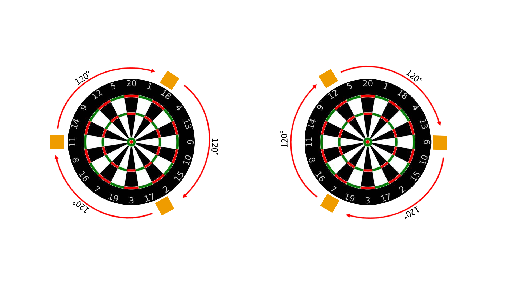
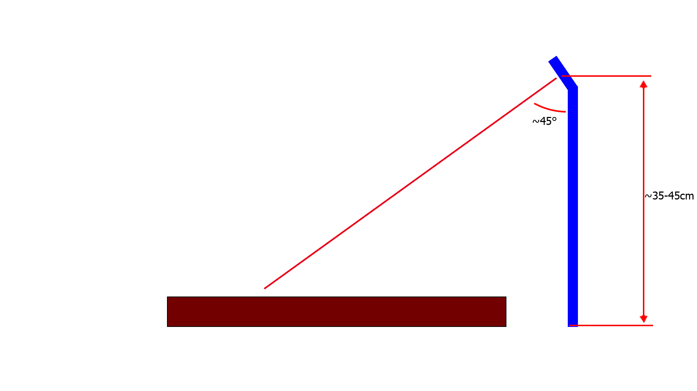
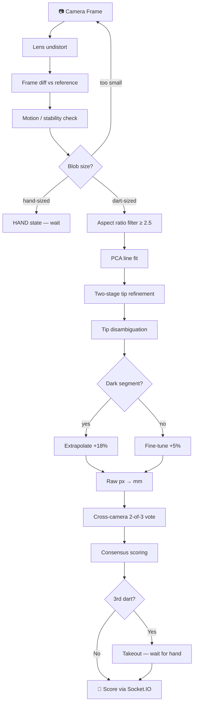

# ThrowVision 🎯


**ThrowVision** is an open-source, camera-based automatic dart scoring system. Three USB webcams at 120° intervals detect dart tips with millimetre accuracy using frame differencing, perspective homography, and multi-camera consensus fusion.

---

## What's New in v1.2.0

### 🎨 UI/UX & Visual Enhancements
- Modernized frontend with a focus on visual aesthetics and responsive performance.
- Automatically maximized Electron app window on startup.
- Fullscreen capabilities with an "Esc" key toggle on the home page.
- Major UI scaling for game modes: Increased font sizes for player scores and names.
- Broadcast-quality redesign of the Count-Up mode with a prominent large-text layout.

### 🛡️ System Reliability & Pre-flight Checks
- **Strict Pre-flight Checks:** Enforced checks for "Practice" and "Game" modes to verify camera status, calibration, and board profiles before starting.
- **Robust Camera Verification:** System checker now verifies actual physical camera connections, preventing false positives when cameras are unplugged.
- Fixed a major scoring bug in 301 where valid checkouts were incorrectly registered as busts.
- Fixed a double-saving bug in the stats persistence layer for Count-Up, ensuring accurate game statistics.

### 🏗️ Architecture & Refactoring
- Systematically refactored and modularized backend and frontend code for improved maintainability.

---

## What's New in v1.1.0

### 🔬 Lens Distortion Calibration
- Full-screen calibration modal — move a checkerboard around each camera frame
- **Live red heatmap overlay** shows covered areas (8×6 grid, 48 cells)
- **Blue guide ellipse** drawn on live feed to guide coverage sweeping
- Auto-captures frames when corners detected; auto-computes at 95% coverage
- Per-camera calibration badges in Settings showing RMS error
- Built-in checkerboard SVG download (no external tools needed)

### 📐 8-Point Board Calibration
- 4 outer (double ring) + 4 inner (triple ring) calibration handles
- `cv2.findHomography` with RANSAC — far more accurate than 4-pt
- Orange triple-ring band highlighted in the interactive overlay
- Rotate-points buttons (◀ ▶) work correctly in both 4-pt and 8-pt modes

### 🎯 Auto-Refine Calibration (Color Ring Detection)
- New **🎯 Refine** button in the calibration toolbar
- **Coarse-to-fine**: rough 4-pt drag → system refines automatically
- Detects red/green dartboard bands via HSV segmentation in warped space
- 24 points sampled per ring (50–200 total) → RANSAC sub-pixel homography
- Shows annotated warp preview (detected rings circled) before accepting
- New module: `auto_ellipse.py`

### 🏗️ Other Changes
- Fixed `board_profile.py` crash: `reshape(-1,2)` supports 4-pt and 8-pt auto-cal
- Removed unused `board_annotator.py` and all three `/api/board-annotate/*` routes

---

## Features

- 🎯 **3-camera automatic scoring** — triangulates dart tip, eliminating parallax
- 🔀 **Cross-camera mask intersection** — 2-of-3 vote cancels shaft/flight residuals
- 🧮 **Multi-camera consensus** — majority vote, outlier rejection, quality-weighted avg
- 🔬 **Lens distortion calibration** — per-camera undistortion with coverage heatmap
- 📐 **8-point perspective calibration** — RANSAC homography with double + triple ring anchors
- 🎯 **Auto-refine calibration** — HSV ring detector auto-snaps points to exact positions
- 🎮 **Game modes** — X01 (301/501/701/901), Cricket, Count Up, Bullseye throw-off
- 🌐 **Live web dashboard** — real-time scoring at `http://localhost:5000`
- ✋ **Turn takeout system** — waits for hand detection after 3rd dart before advancing
- 🔄 **System checker** — validates cameras, calibration, and detection engine on startup
- 📡 **Offline guard** — shows "System Offline" modal if server not connected

---

## Hardware Requirements

| Item | Spec |
|---|---|
| Cameras | 3× USB webcams, 1080p recommended |
| USB | USB 2.0 — each camera on its own USB controller |
| OS | Windows (tested) / Linux |
| CPU | Any modern x86-64 multi-core |
| GPU | Not required — CPU-based OpenCV only |

### Camera Mounting

Mount 3 cameras at **equal 120° intervals** around the board.

| View | Diagram |
|:---:|:---:|
| **Top-down** — 120° spacing | **Side view** — ~45° angle, 35–45 cm above |
|  |  |

**Checklist:**
- ✅ All 3 cameras at the same height (board centre level or slightly above)
- ✅ Each camera angled ~45° downward toward board centre
- ✅ Full board visible in every frame
- ✅ Each camera on its own USB controller
- ✅ Cameras **rigidly mounted**

---

## Installation

### Option A — Desktop App (recommended)

```bash
git clone https://github.com/kashiwagiren/ThrowVision.git
cd ThrowVision

# Python backend
python -m venv .venv && .venv\Scripts\activate
pip install flask flask-socketio opencv-python numpy psutil pyinstaller

# Electron
npm install
```

### Option B — Browser only

```bash
git clone https://github.com/kashiwagiren/ThrowVision.git
cd ThrowVision
python -m venv .venv && .venv\Scripts\activate
pip install flask flask-socketio opencv-python numpy psutil
```

---

## Quick Start

```bash
npm start                         # desktop window
python server.py                  # browser at http://localhost:5000
python server.py --demo           # single camera
python server.py --cameras 0,1,2  # custom indices
```

---

## Calibration Guide

> **Order matters:** Lens calibration first, then board calibration.

### Step 1 — Lens Calibration

1. **Settings → Lens Calibration → 🔬 Cam X**
2. Hold a printed checkerboard into the frame
3. Move it across all areas — **red cells appear** as coverage grows
4. Fill the blue guide ellipse to 95% — calibration auto-computes
5. Repeat for all 3 cameras

### Step 2 — Board Calibration

1. **Board Calibration → 8-pt mode**
2. Drag **cyan** handles to outer edge of **double ring** (12, 3, 6, 9 o'clock)
3. Drag **orange** handles to inner edge of **triple ring** (45° offsets)
4. Click **🎯 Refine** — HSV ring detection auto-snaps handles to exact positions
5. Check warp preview — grid lines should be straight
6. Click **Accept**

> **🎯 Refine** tolerates ±20 px rough placement. If it fails, ensure good lighting and that the rough points bracket the board.

---

## Project Structure

```
ThrowVision/
├── server.py          # Flask + Socket.IO server, detection loop
├── detector.py        # DartDetector — per-camera state machine & tip extraction
├── calibrator.py      # BoardCalibrator — 4/8-pt RANSAC perspective transform
├── scorer.py          # ScoreMapper — multi-camera consensus & scoring
├── config.py          # ConfigManager — all tuneable parameters
├── game_mode.py       # X01, Cricket, CountUp, BullseyeThrow engines
├── board_profile.py   # Save/load board position profiles
├── lens_calibrator.py # LensCalibrator — checkerboard undistortion + coverage
├── auto_ellipse.py    # HSV ring detector for auto-refine calibration
├── stats.py           # Per-game statistics
├── throwvision.spec   # PyInstaller build spec
├── package.json       # Electron project + npm scripts
├── electron/
│   ├── main.js        # Electron main process (spawns Python, shows splash)
│   ├── splash.html    # Branded loading screen
│   └── preload.js     # Security preload (contextIsolation)
├── frontend/          # Dashboard (HTML + JS + CSS)
└── calibration/       # Per-camera .npz files (gitignored)
```

---

## Building a Distributable

```bash
npm run pyinstaller   # → dist/server/server.exe
npm run build:win     # → dist-electron/ThrowVision Setup 1.1.0.exe
```

---

## How the System Works

### 1. Calibration

**Lens undistortion:** `cv2.calibrateCamera()` → K + distortion coefficients d → `cv2.undistort(frame, K, d)`

**Perspective homography (8-pt):**
```
cv2.findHomography(src_8pts, dst_8pts, RANSAC) → 3×3 matrix H
```
4 outer anchors (double ring, 170 mm) + 4 inner anchors (triple ring, 107 mm).

**Auto-refine:** Rough H warps frame → HSV detects red/green rings as circles → 50–200 correspondences → refined H.

### 2. Detection

Each camera runs an independent state machine: **WAIT → MOTION → STABLE → DART → TAKEOUT**

Detection steps per dart:
1. Frame differencing vs stored reference
2. Blob size filter (dart vs hand vs noise)
3. Aspect ratio filter (≥ 2.5 = dart shaft shape)
4. PCA line fit → dart axis
5. Two-stage tip refinement (25% zone → 5% extremum)
6. Tip disambiguation (warped-space distance fallback)
7. Dark-segment correction (+18% extrapolation on black segments)
8. Raw px → mm via direct homography

### 3. Scoring

```
Priority 1: Cross-camera mask intersection  ← most accurate
Priority 2: Majority vote (2/3 agree)
Priority 3: Outlier rejection (drop if >40mm from others)
Priority 4: Quality-weighted average
Priority 5: Near-boundary → best single camera wins
```

---

## Detection Pipeline



---

## Game Modes

| Mode | How to Win | Key Rule |
|---|---|---|
| **X01** (301/501/701/901) | Reach exactly 0 | Must finish on a **double**. Bust = score back. |
| **Cricket** | Close 15–20 + Bull, score ≥ opponent | 3 hits to close a number. |
| **Count Up** | Highest total after N rounds | No bust. |
| **Bullseye Throw-off** | Closest to bull goes first | Tiebreak re-throw if within 1 mm. |

---

## API Reference

| Endpoint | Description |
|---|---|
| `GET /api/status` | Camera states, last score |
| `GET /api/settings` | Current config |
| `GET /api/lens/autoframe/<cam_id>` | Live lens cal JPEG with heatmap |
| `GET /api/lens/status/<cam_id>` | Lens calibration RMS + status |
| `POST /api/cal/refine/<cam_id>` | Auto-refine via HSV ring detection |
| `GET /api/cal/auto/<cam_id>` | Feature-match auto board calibration |

---

## Configuration

| Parameter | Default | Description |
|---|---|---|
| `resolution` | `(1920, 1080)` | Camera capture resolution |
| `fps` | `30` | Capture frame rate |
| `dart_size_min` | `800` | Minimum contour area (px²) |
| `binary_thresh` | `30` | Frame-diff threshold |
| `detection_speed` | `DEFAULT` | `VERY_LOW` / `LOW` / `DEFAULT` / `HIGH` / `VERY_HIGH` |

---

## Tips for Best Accuracy

- 🔬 **Run lens calibration first** — barrel distortion shifts all ring positions
- 📐 **Use 8-pt + Refine** — substantially better than 4-pt manual drag
- 💡 **Even lighting** — helps HSV ring detection during refine
- 🌈 **Bright contrasting flights** — pink/orange/yellow work best
- 📷 **Keep cameras rigid** — any wobble after calibration degrades accuracy
- 🔧 **Redo board calibration** if you move a camera or redo lens calibration

---

## Changelog

### v1.2.0 — 2026-03-29
- **NEW** Extensive UI/UX modernizations, including game mode UI resizing, broadcast-quality Count-Up display, and fullscreen behaviors.
- **NEW** Maximized application window on startup.
- **NEW** Strict pre-flight system checks (verifying physical cameras, calibration, and board profiles) before launching games.
- **FIX** 301 Bust bug that incorrectly reverted valid checkouts.
- **FIX** Count-Up stats double-saving bug and restored data integrity.
- **FIX** Camera system checker properly detects unplugged physical cameras.
- **REFACTOR** Systematic modularization of frontend and backend architecture.

### v1.1.0 — 2026-03-22
- **NEW** Lens distortion calibration: fullscreen modal, live heatmap overlay, blue guide ring, auto-compute at 95% coverage
- **NEW** 8-point board calibration mode with RANSAC homography
- **NEW** 🎯 Auto-Refine button: HSV color ring detection → sub-pixel accuracy
- **NEW** `auto_ellipse.py` — coarse-to-fine ring detector (warped-space HSV → circle fitting → RANSAC)
- **NEW** `lens_calibrator.py` — LensCalibrator with 8×6 coverage grid tracking
- **FIX** `board_profile.py` crash in 8-pt auto-cal mode (`reshape(-1,2)`)
- **CLEANUP** Removed `board_annotator.py` and all `/api/board-annotate/*` routes

### v1.0.0
- Initial release: 3-camera scoring, X01/Cricket/Count Up, cross-camera mask intersection, 4-pt perspective calibration, takeout system, system checker

---

## License

MIT License — see [LICENSE](LICENSE) for details.
