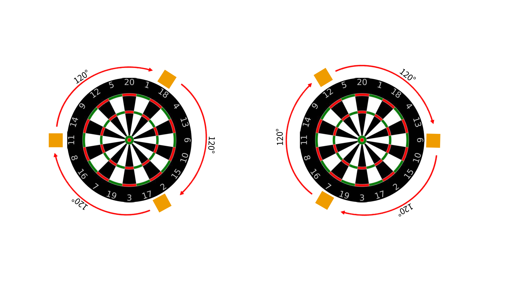
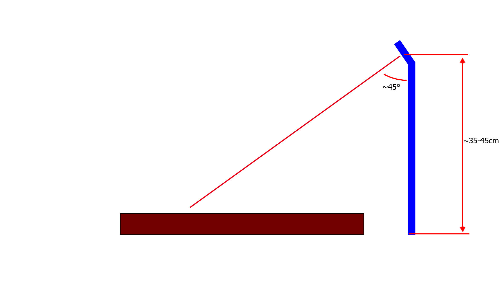

# ThrowVision 🎯


**ThrowVision** is an open-source, camera-based automatic dart scoring system. Three USB webcams at 120° intervals detect dart tips with millimetre accuracy using frame differencing, perspective homography, and multi-camera consensus fusion.

---

## What's New in v1.4.1

### Windows Release Build
- Bumped the desktop release to `v1.4.1`.
- Added this patch release to ship built Windows executable artifacts with the GitHub release.
- Kept the v1.4.0 match-review, calibration, scoring, and README flowchart updates intact.

---

## What's New in v1.4.0

### Match Review & Game Traceability
- Added a full Match Review page for completed and abandoned X01, Cricket, and Count Up games.
- Captures per-dart camera frames plus end-of-turn frames, then stores them in `data/match_reviews/`.
- Match History rows now show review availability and open the review bundle directly.
- Added raw, annotated, and warped frame review endpoints for per-camera inspection.
- Added lightbox navigation for review captures, with Escape/back handling and focused per-dart camera paging.

### Release, Calibration & Scoring
- Bumped the desktop release to `v1.4.0` across npm metadata, the package lock, UI footer, README badge, build notes, and changelog.
- Fixed the 8-point calibration anchor order so manual handles, frontend hints, and backend homography anchors agree.
- Saved the millimetre homography in calibration cache files for more reliable reloads.
- Added a Settings toggle for startup auto-calibration when cameras are active.
- Expanded the outside-board tolerance so near-edge throws remain reviewable as `MISS` instead of disappearing as `OFF`.

### Match Flow & Training Tools
- Added Player 1 / Player 2 names and persisted flight-color selection for the game UI.
- Added bot opponent support, including simulated skill levels and auto-advance mode for hands-free testing.
- Added match abandonment handling so user quit and server shutdown paths still save a reviewable match record.
- Added tests for bot simulation, stats id reservation, match-review storage, and match-review HTTP endpoints.

---

## What's New in v1.3.0

### Accuracy Review & Validation
- Added a full accuracy-review workflow for Practice mode with per-dart confirm, edit, false-positive, and missed-dart correction flows.
- Added manual `+ Add Event` support for undetected throws such as bounce-outs, falls, and no-detection cases.
- Added X01 turn-review support so the same review pipeline can be used beyond Practice.
- Added persistent `accuracy_sessions` storage and backend review APIs for post-session analysis.

### Accuracy Stats & Session Management
- Split game stats and accuracy stats into separate dashboard sections.
- Added accuracy summary cards, camera-agreement breakdowns, and session history tables.
- Added reset controls for game stats and accuracy stats, plus per-match/per-session delete flows.
- Added reviewed practice/session data aggregation for real precision, recall, corrections, misses, and false positives.

### Detection, Calibration & Hardware
- Added OpenVINO model loading for both tip pose inference and calibration inference.
- Added ML-assisted and anchor-refine calibration helpers on top of the existing manual calibration workflow.
- Added TF-Luna foul-line distance sensor support for oche monitoring.
- Widened the outside-board miss boundary so near-miss throws are captured more reliably as `MISS` instead of disappearing.

### Frontend & Game Flow
- Restored and stabilized the pre-game frontend after redesign regressions.
- Improved Practice review UX with focused dart review, manual event entry, and clearer finish-turn state handling.
- Added dedicated accuracy review modals and review-state syncing between frontend and backend.
- Refined stats, calibration, and game-mode flows to support the newer review and model pipeline.

---

## What's New in v1.2.0

### 🎨 UI/UX & Visual Enhancements
- Modernized frontend with a focus on visual aesthetics and responsive performance.
- Automatically maximized Electron app window on startup.
- Fullscreen capabilities with an "Esc" key toggle on the home page.
- Major UI scaling for game modes: Increased font sizes for player scores and names.
- Broadcast-quality redesign of the Count-Up mode with a prominent large-text layout.

### 🛡️ System Reliability & Pre-flight Checks
- **Strict Pre-flight Checks:** Enforced checks for "Practice" and "Game" modes to verify camera status, calibration, and board profiles before starting.
- **Robust Camera Verification:** System checker now verifies actual physical camera connections, preventing false positives when cameras are unplugged.
- Fixed a major scoring bug in 301 where valid checkouts were incorrectly registered as busts.
- Fixed a double-saving bug in the stats persistence layer for Count-Up, ensuring accurate game statistics.

### 🏗️ Architecture & Refactoring
- Systematically refactored and modularized backend and frontend code for improved maintainability.

---

## What's New in v1.1.0

### 🔬 Lens Distortion Calibration
- Full-screen calibration modal — move a checkerboard around each camera frame
- **Live red heatmap overlay** shows covered areas (8×6 grid, 48 cells)
- **Blue guide ellipse** drawn on live feed to guide coverage sweeping
- Auto-captures frames when corners detected; auto-computes at 95% coverage
- Per-camera calibration badges in Settings showing RMS error
- Built-in checkerboard SVG download (no external tools needed)

### 📐 8-Point Board Calibration
- 4 outer (double ring) + 4 inner (triple ring) calibration handles
- `cv2.findHomography` with RANSAC — far more accurate than 4-pt
- Orange triple-ring band highlighted in the interactive overlay
- Rotate-points buttons (◀ ▶) work correctly in both 4-pt and 8-pt modes

### 🎯 Auto-Refine Calibration (Color Ring Detection)
- New **🎯 Refine** button in the calibration toolbar
- **Coarse-to-fine**: rough 4-pt drag → system refines automatically
- Detects red/green dartboard bands via HSV segmentation in warped space
- 24 points sampled per ring (50–200 total) → RANSAC sub-pixel homography
- Shows annotated warp preview (detected rings circled) before accepting
- New module: `auto_ellipse.py`

### 🏗️ Other Changes
- Fixed `board_profile.py` crash: `reshape(-1,2)` supports 4-pt and 8-pt auto-cal
- Removed unused `board_annotator.py` and all three `/api/board-annotate/*` routes

---

## Features

- 🎯 **3-camera automatic scoring** — triangulates dart tip, eliminating parallax
- 🔀 **Cross-camera mask intersection** — 2-of-3 vote cancels shaft/flight residuals
- 🧮 **Multi-camera consensus** — majority vote, outlier rejection, quality-weighted avg
- 🔬 **Lens distortion calibration** — per-camera undistortion with coverage heatmap
- 📐 **8-point perspective calibration** — RANSAC homography with double + triple ring anchors
- 🎯 **Auto-refine calibration** — HSV ring detector auto-snaps points to exact positions
- 🤖 **OpenVINO inference support** — YOLO11 detection/pose runtime with CPU/GPU/AUTO device selection
- 📊 **Accuracy review system** — practice and X01 turn review, manual corrections, and accuracy session storage
- 🧾 **Match review system** — per-match raw, annotated, and warped camera captures for post-game inspection
- 📝 **Manual event capture** — add undetected bounce, miss, and fall events directly from practice mode
- 📈 **Split stats dashboards** — dedicated game stats and accuracy stats views with reset/delete actions
- 🤖 **Bot opponent support** — simulated skill levels and auto-advance mode for testing game flow
- 📏 **TF-Luna foul-line sensor support** — optional oche distance monitoring over serial
- 🎮 **Game modes** — X01 (301/501/701/901), Cricket, Count Up, Bullseye throw-off
- 🌐 **Live web dashboard** — real-time scoring at `http://localhost:5000`
- ✋ **Turn takeout system** — waits for hand detection after 3rd dart before advancing
- 🔄 **System checker** — validates cameras, calibration, and detection engine on startup
- 📡 **Offline guard** — shows "System Offline" modal if server not connected

---

## Hardware Requirements

| Item | Spec |
|---|---|
| Cameras | 3× USB webcams, 1080p recommended |
| USB | USB 2.0 — each camera on its own USB controller |
| OS | Windows (tested) / Linux |
| CPU | Any modern x86-64 multi-core |
| GPU | Not required — CPU-based OpenCV only |

### Camera Mounting

Mount 3 cameras at **equal 120° intervals** around the board.

| View | Diagram |
|:---:|:---:|
| **Top-down** — 120° spacing | **Side view** — ~45° angle, 35–45 cm above |
|  |  |

**Checklist:**
- ✅ All 3 cameras at the same height (board centre level or slightly above)
- ✅ Each camera angled ~45° downward toward board centre
- ✅ Full board visible in every frame
- ✅ Each camera on its own USB controller
- ✅ Cameras **rigidly mounted**

---

## Installation

### Option A — Desktop App (recommended)

```bash
git clone https://github.com/kashiwagiren/ThrowVision.git
cd ThrowVision

# Python backend
python -m venv .venv && .venv\Scripts\activate
pip install flask flask-socketio opencv-python numpy psutil pyinstaller openvino pyyaml pyserial ultralytics

# Electron
npm install
```

### Option B — Browser only

```bash
git clone https://github.com/kashiwagiren/ThrowVision.git
cd ThrowVision
python -m venv .venv && .venv\Scripts\activate
pip install flask flask-socketio opencv-python numpy psutil openvino pyyaml pyserial ultralytics
```

---

## Quick Start

```bash
npm start                         # desktop window
python server.py                  # browser at http://localhost:5000
python server.py --demo           # single camera
python server.py --cameras 0,1,2  # custom indices
```

---

## Calibration Guide

> **Order matters:** Lens calibration first, then board calibration.

### Step 1 — Lens Calibration

1. **Settings → Lens Calibration → 🔬 Cam X**
2. Hold a printed checkerboard into the frame
3. Move it across all areas — **red cells appear** as coverage grows
4. Fill the blue guide ellipse to 95% — calibration auto-computes
5. Repeat for all 3 cameras

### Step 2 — Board Calibration

1. **Board Calibration → 8-pt mode**
2. Drag **cyan** handles to outer edge of **double ring** (12, 3, 6, 9 o'clock)
3. Drag **orange** handles to inner edge of **triple ring** (45° offsets)
4. Click **🎯 Refine** — HSV ring detection auto-snaps handles to exact positions
5. Check warp preview — grid lines should be straight
6. Click **Accept**

> **🎯 Refine** tolerates ±20 px rough placement. If it fails, ensure good lighting and that the rough points bracket the board.

---

## Project Structure

```
ThrowVision/
├── server.py          # Flask + Socket.IO server, detection loop
├── detector.py        # DartDetector — per-camera state machine & tip extraction
├── calibrator.py      # BoardCalibrator — 4/8-pt RANSAC perspective transform
├── scorer.py          # ScoreMapper — multi-camera consensus & scoring
├── config.py          # ConfigManager — all tuneable parameters
├── game_mode.py       # X01, Cricket, CountUp, BullseyeThrow engines
├── bot_player.py      # Simulated and auto-advance bot opponent helpers
├── board_profile.py   # Save/load board position profiles
├── lens_calibrator.py # LensCalibrator — checkerboard undistortion + coverage
├── auto_ellipse.py    # HSV ring detector for auto-refine calibration
├── stats.py           # Game statistics + history management
├── accuracy_stats.py  # Practice/X01 accuracy session storage + aggregation
├── match_review.py    # Per-match review bundles, frame capture, annotated overlays
├── openvino_inference.py # OpenVINO YOLO runtime wrapper for detect/pose models
├── ml_calibration.py  # ML-assisted calibration from detected ring landmarks
├── anchor_refine.py   # Anchor-based calibration refinement helpers
├── tfluna.py          # TF-Luna oche distance sensor reader
├── yolo_verifier.py   # Optional YOLO-based dart-tip validation
├── throwvision.spec   # PyInstaller build spec
├── package.json       # Electron project + npm scripts
├── electron/
│   ├── main.js        # Electron main process (spawns Python, shows splash)
│   ├── splash.html    # Branded loading screen
│   └── preload.js     # Security preload (contextIsolation)
├── frontend/          # Dashboard (HTML + JS + CSS)
├── tests/             # Bot, stats, match-review unit/integration tests
├── calibration/       # Per-camera .npz files (gitignored)
└── data/              # Stats, accuracy sessions, and match reviews (runtime)
```

---

## Building a Distributable

```bash
npm run pyinstaller   # → dist/server/server.exe
npm run build:win     # → dist-electron/ThrowVision Setup 1.4.1.exe
```

---

## How the System Works

ThrowVision is built as one continuous loop: calibration creates camera-to-board geometry, detection finds dart tips, scoring fuses the cameras into one board result, game mode logic consumes that result, and stats/review layers persist what happened.

### 1. Calibration

**Lens calibration** removes per-camera distortion first:
```
checkerboard frames -> cv2.calibrateCamera() -> K + distortion -> cv2.undistort()
```

**Board calibration** maps camera pixels to dartboard millimetres:
```
4 or 8 board anchors -> cv2.findHomography(..., RANSAC) -> H_px + H_mm
```

The current 8-point model uses 4 outer double-ring anchors plus 4 inner triple-ring anchors in this order:
`D20/D1`, `D11/D14`, `D3/D19`, `D6/D10`, then the matching triple-ring anchors.

**Auto calibration/refine** can seed or improve those anchors through three paths:
- OpenVINO calibration model (`ml_calibration.py`) when model detections are available.
- Saved board profile matching (`board_profile.py`) for known board/camera positions.
- Anchor or HSV ring refinement (`anchor_refine.py`, `auto_ellipse.py`) from rough handles.

### 2. Detection

Each active camera owns a `DartDetector` state machine:
`WAIT -> MOTION -> STABLE -> DART -> TAKEOUT`

Per camera, a dart goes through frame differencing, contour filtering, hand rejection, pose/tip validation, PCA line fitting, tip refinement, and homography conversion into board millimetres. Detection can use OpenVINO pose inference when configured, then cross-check it against classic line-fit geometry.

### 3. Scoring

`ScoreMapper` converts each camera's millimetre tip into a label and fuses camera results. The priority order is:

1. Cross-camera mask intersection.
2. 2-of-3 majority agreement.
3. Outlier rejection for spread-out tips.
4. Quality-weighted average.
5. Near-boundary best-camera fallback.
6. Single-camera fallback for low-confidence but usable throws.

The final result includes the label, score, fused coordinates, agreement bucket, per-camera details, and timing data. That same prediction feeds Practice, X01 review, match review, and game stats.

### 4. Game, Review & Stats

Practice mode starts an accuracy session, records every prediction, lets the user confirm or correct actual darts, and aggregates precision/recall, misses, false positives, corrections, camera agreement, and latency.

Game mode starts with an optional bullseye throw-off, then runs X01, Cricket, or Count Up. Human darts come from detection; bot darts can come from the simulated or auto-advance bot helper. At game start, stats reserve a match id so `match_review.py` can create a review bundle immediately.

Every confirmed in-game dart can write per-camera frames to `data/match_reviews/`, and every completed turn can write end-of-turn frames. Finished games are saved to `data/stats.json`; completed or abandoned match reviews remain available from Match History.

---

## Full System Flowchart


```mermaid
flowchart TD
    A["Launch ThrowVision"] --> B["Electron main starts Flask/Socket.IO server"]
    B --> C["Frontend connects and requests /api/status"]
    C --> D{"Settings and cameras ready?"}

    D -->|Settings| E["Load settings.json into ConfigManager"]
    D -->|Cameras| F["Open USB cameras through DartDetector"]
    E --> G["Load OpenVINO pose/calibration models if configured"]
    F --> H["Load lens .npz and board calibration .npz"]
    H --> I{"Calibration complete?"}

    I -->|No| J["Lens Calibration"]
    J --> J1["Checkerboard detection"]
    J1 --> J2["Coverage heatmap reaches target"]
    J2 --> J3["Compute K/distortion and save per camera"]
    J3 --> K["Board Calibration"]

    I -->|Yes| L["Ready for Practice or Game"]
    K --> K1["Manual 4/8-point handles"]
    K --> K2["Auto calibration: ML, board profile, or anchor refine"]
    K1 --> K3["RANSAC homography to board pixels and millimetres"]
    K2 --> K3
    K3 --> K4["Save calibration cache with H_mm and masks"]
    K4 --> L

    L --> M{"User mode"}
    M -->|Practice| N["Start detection and accuracy session"]
    M -->|Game| O["Optional bullseye throw-off"]
    M -->|Stats| P["Load game stats and accuracy stats"]

    O --> O1["Create X01, Cricket, or Count Up engine"]
    O1 --> O2["Reserve stats id and start match_review bundle"]
    O2 --> Q["Start detection loop"]
    N --> Q

    Q --> R["Per-camera frame capture"]
    R --> S["Lens undistort and board warp"]
    S --> T["Frame diff, motion stability, contour filtering"]
    T --> U{"Hand, noise, or dart?"}
    U -->|Hand| U1["Wait for takeout / stable board"]
    U -->|Noise| R
    U -->|Dart| V["Pose model or line-fit tip extraction"]
    V --> W["Tip refine, dark-segment correction, raw px -> mm"]
    W --> X["ScoreMapper camera consensus"]
    X --> Y["Emit dart_scored over Socket.IO"]

    Y --> Z{"Practice or Game?"}
    Z -->|Practice| AA["Update practice board, log, and accuracy prediction"]
    AA --> AB["User confirms, edits, marks false positive, or adds missed event"]
    AB --> AC["Save accuracy_stats session and summary"]

    Z -->|Game| AD["record_dart() in game engine"]
    AD --> AE["match_review records per-dart frames"]
    AE --> AF{"Third dart / turn over?"}
    AF -->|No| Q
    AF -->|Yes| AG["Wait for takeout or skip_takeout"]
    AG --> AH["match_review records end-of-turn frames"]
    AH --> AI{"Game finished?"}
    AI -->|No| Q
    AI -->|Yes| AJ["Finalize game stats and match review"]

    AJ --> P
    AC --> P
    P --> AK["Stats dashboard"]
    AK --> AL["Game Stats: totals, averages, wins, history"]
    AK --> AM["Accuracy Stats: precision, recall, misses, false positives"]
    AL --> AN{"History row has review bundle?"}
    AN -->|Yes| AO["Open Match Review"]
    AO --> AP["Review raw, annotated, and warped camera captures"]
    AN -->|No| AQ["Show non-clickable legacy row"]

    AD --> AR{"Quit, shutdown, or abandon?"}
    AR -->|Yes| AS["Save abandoned stats row and finalize review as abandoned"]
    AS --> P
```

---

## Game Modes

| Mode | How to Win | Key Rule |
|---|---|---|
| **X01** (301/501/701/901) | Reach exactly 0 | Must finish on a **double**. Bust = score back. |
| **Cricket** | Close 15–20 + Bull, score ≥ opponent | 3 hits to close a number. |
| **Count Up** | Highest total after N rounds | No bust. |
| **Bullseye Throw-off** | Closest to bull goes first | Tiebreak re-throw if within 1 mm. |

---

## API Reference

| Endpoint | Description |
|---|---|
| `GET /api/status` | Camera states, last score |
| `GET /api/settings` | Current config |
| `POST /api/settings` | Save runtime settings, detection profile, OpenVINO, and TF-Luna options |
| `GET /api/cameras/probe` | Verify physical camera availability |
| `GET /api/cameras/resolutions` | List supported camera resolutions |
| `GET /api/lens/autoframe/<cam_id>` | Live lens cal JPEG with heatmap |
| `GET /api/lens/status/<cam_id>` | Lens calibration RMS + status |
| `POST /api/cal/refine/<cam_id>` | Auto-refine via HSV ring detection |
| `GET /api/cal/auto/<cam_id>` | Feature-match auto board calibration |
| `GET /api/stats` | Aggregated game stats and recent match history |
| `GET /api/stats/recent` | Recent match rows with `has_review` flags |
| `DELETE /api/stats/game/<game_id>` | Delete one match and its review bundle |
| `GET /api/accuracy/summary` | Aggregated accuracy-review metrics |
| `GET /api/accuracy/sessions` | Accuracy-review session list |
| `POST /api/accuracy/review` | Save Practice accuracy review corrections |
| `POST /api/accuracy/review/x01-action` | Apply or continue an X01 turn review |
| `GET /api/matches/<id>/review` | Fetch a completed/abandoned match-review bundle |
| `GET /api/matches/<id>/frame/<kind>/<p>/<r>/<d>/<cam>` | Fetch a raw match-review frame |
| `GET /api/matches/<id>/frame/<kind>/<p>/<r>/<d>/<cam>/annotated` | Fetch an annotated match-review frame |
| `GET /api/matches/<id>/frame/<kind>/<p>/<r>/<d>/<cam>/warped` | Fetch a warped match-review frame using current calibration |
| `GET /api/tfluna/scan` | Auto-detect a TF-Luna serial port |
| `POST /api/tfluna/probe` | Probe a TF-Luna sensor on a selected port |

---

## Configuration

| Parameter | Default | Description |
|---|---|---|
| `resolution` | `(1920, 1080)` | Camera capture resolution |
| `fps` | `30` | Capture frame rate |
| `dart_size_min` | `800` | Minimum contour area (px²) |
| `binary_thresh` | `30` | Frame-diff threshold |
| `detection_speed` | `DEFAULT` | `VERY_LOW` / `LOW` / `DEFAULT` / `HIGH` / `VERY_HIGH` |
| `calibrate_on_startup` | `false` | Run auto-calibration once after active cameras open |
| `openvino_device` | `CPU` | Preferred OpenVINO device (`CPU`, `GPU`, or `AUTO`) |
| `pose_enabled` | `true` | Enable OpenVINO pose-based dart-tip detection when a model is available |
| `cal_enabled` | `true` | Enable OpenVINO ML-assisted board calibration when a model is available |
| `tfluna_enabled` | `false` | Enable optional foul-line distance monitoring |

---

## Tips for Best Accuracy

- 🔬 **Run lens calibration first** — barrel distortion shifts all ring positions
- 📐 **Use 8-pt + Refine** — substantially better than 4-pt manual drag
- 💡 **Even lighting** — helps HSV ring detection during refine
- 🌈 **Bright contrasting flights** — pink/orange/yellow work best
- 📷 **Keep cameras rigid** — any wobble after calibration degrades accuracy
- 🔧 **Redo board calibration** if you move a camera or redo lens calibration

---

## Changelog

### v1.4.1 — 2026-04-21
- **RELEASE** Bumped package metadata, README badge, build notes, and footer version to `v1.4.1`.
- **BUILD** Added this patch release for publishing Windows executable artifacts alongside the GitHub release.

### v1.4.0 — 2026-04-21
- **NEW** Match Review page for X01, Cricket, and Count Up with per-dart and end-of-turn camera captures.
- **NEW** Review bundles under `data/match_reviews/`, including raw frame serving, annotated overlays, warped frame views, and orphan-folder recovery.
- **NEW** Clickable Match History rows when `has_review` is available; deleting a game also deletes its review bundle.
- **NEW** Bot opponent support with simulated skill levels and auto-advance mode for game-flow testing.
- **NEW** Player names and flight-color selection in the game setup and scoreboard flow.
- **NEW** Startup auto-calibration setting for running the auto-calibration pipeline after cameras open.
- **IMPROVE** Full README system flowchart now documents calibration, detection, scoring, games, match review, accuracy review, and stats.
- **FIX** 8-point calibration anchor order now matches frontend handles, hints, wireframe preview, and backend homography anchors.
- **FIX** Calibration caches include the millimetre homography for more reliable reload behavior.
- **FIX** Wider near-edge board tolerance keeps more outside-board darts as reviewable `MISS` events.

### v1.3.0 — 2026-04-16
- **NEW** Practice accuracy-review workflow with confirm, edit, false-positive, and missed-dart handling.
- **NEW** Manual practice event capture for bounce-outs, falls, and other undetected throws.
- **NEW** Accuracy session storage and analytics via `accuracy_stats.py`.
- **NEW** Dedicated accuracy dashboard with separate reset/history actions from game stats.
- **NEW** OpenVINO inference integration for tip pose and calibration models.
- **NEW** ML-assisted calibration helpers via `ml_calibration.py` and `anchor_refine.py`.
- **NEW** Optional TF-Luna oche distance sensor support.
- **IMPROVE** Wider miss boundary handling for near-outside throws.
- **IMPROVE** Restored/stabilized frontend review and pre-game flows after regression cleanup.

### v1.2.0 — 2026-03-29
- **NEW** Extensive UI/UX modernizations, including game mode UI resizing, broadcast-quality Count-Up display, and fullscreen behaviors.
- **NEW** Maximized application window on startup.
- **NEW** Strict pre-flight system checks (verifying physical cameras, calibration, and board profiles) before launching games.
- **FIX** 301 Bust bug that incorrectly reverted valid checkouts.
- **FIX** Count-Up stats double-saving bug and restored data integrity.
- **FIX** Camera system checker properly detects unplugged physical cameras.
- **REFACTOR** Systematic modularization of frontend and backend architecture.

### v1.1.0 — 2026-03-22
- **NEW** Lens distortion calibration: fullscreen modal, live heatmap overlay, blue guide ring, auto-compute at 95% coverage
- **NEW** 8-point board calibration mode with RANSAC homography
- **NEW** 🎯 Auto-Refine button: HSV color ring detection → sub-pixel accuracy
- **NEW** `auto_ellipse.py` — coarse-to-fine ring detector (warped-space HSV → circle fitting → RANSAC)
- **NEW** `lens_calibrator.py` — LensCalibrator with 8×6 coverage grid tracking
- **FIX** `board_profile.py` crash in 8-pt auto-cal mode (`reshape(-1,2)`)
- **CLEANUP** Removed `board_annotator.py` and all `/api/board-annotate/*` routes

### v1.0.0
- Initial release: 3-camera scoring, X01/Cricket/Count Up, cross-camera mask intersection, 4-pt perspective calibration, takeout system, system checker

---

## License

MIT License — see [LICENSE](LICENSE) for details.
